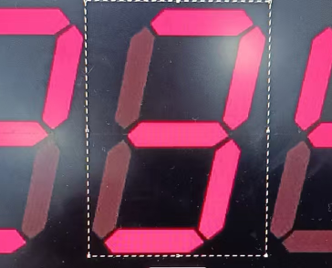
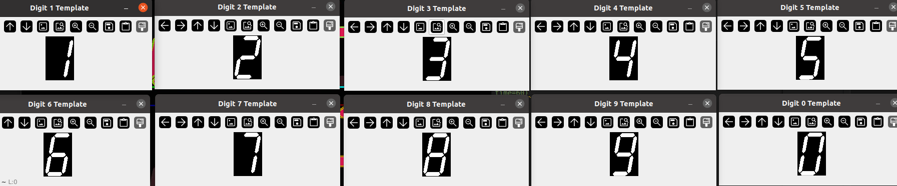

# Number Identification
## Overview
This project is used for turbojet thrusts reader identification

(本项目参考@深蓝的回音，信用卡识别项目，https://bbs.huaweicloud.com/blogs/247279)

## Setup the environment

```bash
conda create -n env_cv python=3.10

conda activate env_cv
```

```bash
pip install opencv-python --upgrade 
pip install numpy imutils matplotlib
```

```bash
# Add the project root to PYTHONPATH
pip install -e .
```

## 使用说明
Firstly, find and record RoI of each segement number on the template:
```bash
python3 scripts/find_roi.py --img template/Segment_digital_tube_number_with_dot.png
```

<div style="text-align: center;">
  
</div>

Then check if the number is extracted correctly. (轮廓中心在RoI就行)

<div style="text-align: center;">
  
</div>

# Find RoI in target images
```bash
python3 scripts/find_roi.py --img output_frames/frame_002090.jpg
```


针对每个视频，主要修改preprocess_target()的 显示屏的框和旋转角度：
box = [633, 225, 75, 37]
angle = -4
其余以进行标准化处理(预处理为100*50像素的图像，可能需要根据亮度微调threshold)

## 最后进行识别
```bash
python3 number_identification_v1.py --data test_record/my_data/turbojet_test_2025-1028-2110.mp4 --output output/turbojet_test_data.csv
```


#### 其他函数，
```bash
# clear output folder
python3 scripts/clear_output_folder.py
# process template to 1-9,0,'dot' group
python3 scripts/process_template.py
# convert video to multi image in frames
python3 scripts/convert_video_2_jpg.py
# get RoI of single image
python3 scripts/preprocess_target.py
# test template matching
python3 scripts/template_matching.py
```